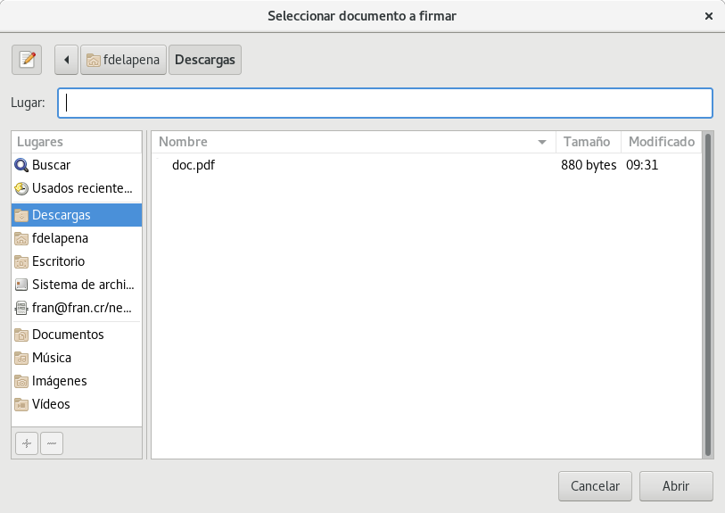
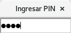
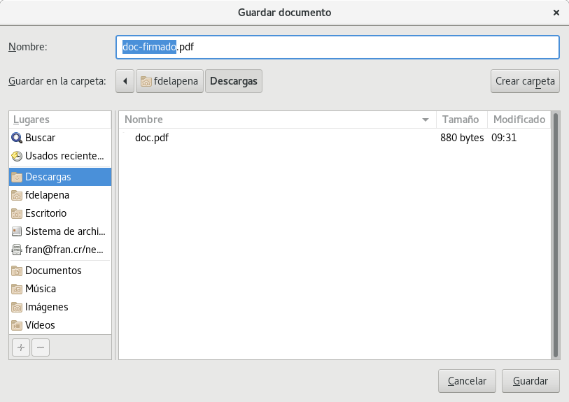
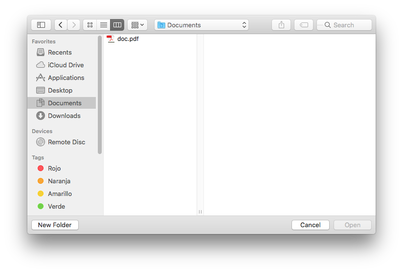
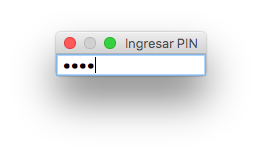
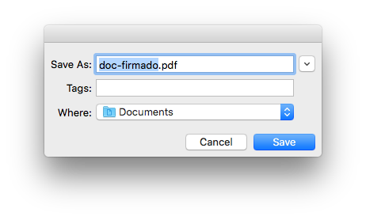
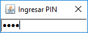
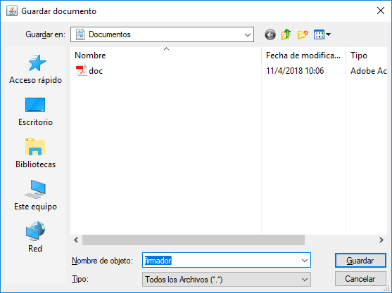

# Firmador

Herramienta de escritorio para firmar documentos que cumplen con la [Política
de Formatos Oficiales de los Documentos Electrónicos Firmados Digitalmente](
https://www.mifirmadigital.go.cr/wp-content/uploads/2016/03/DCFD-Política-de-Formato-Oficial-v1.0.pdf
) de Costa Rica.

Está diseñado para funcionar con Java 8 y funciona en GNU/Linux, macOS y
Windows. En el caso de macOS y Windows requiere [instalar Java 8 (JRE)](
http://www.oracle.com/technetwork/java/javase/downloads/index.html#JDK8) y los
controladores de lector y tarjeta del sitio web de
[descargas de Soporte Firma Digital](https://www.soportefirmadigital.com/sfdj/dl.aspx).
En el caso de GNU/Linux, la forma recomendada para instalarlo está explicada en
los siguientes artículos para
[Fedora](https://fran.cr/instalar-firma-digital-costa-rica-linux-fedora/) y
[Ubuntu](https://fran.cr/instalar-firma-digital-costa-rica-gnu-linux-ubuntu/).

## Descarga

- [Descargar firmador](https://firmador.app/firmador.jar)
  para Windows, GNU/Linux y macOS.

## Capturas de pantalla

GNU/Linux:

macOS:

Windows:

## Compilación del código fuente

Para compilar el ejemplo se requiere Maven.

Para generar el JAR:

`mvn clean package`

Para ejecutar el JAR:

`java -jar target/firmador.jar`

## Licencia

Copyright © 2018 de los autores de Firmador.

La lista de autores de Firmador se encuentra en el fichero
[AUTHORS.md](AUTHORS.md).

Este programa es software libre, distribuido bajo la licencia GPL versión 3 o
en sus versiones posteriores.

El texto de la licencia está disponible en el fichero [COPYING](COPYING).
