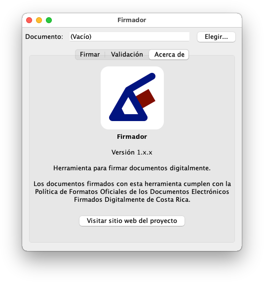

# Firmador

Herramienta de escritorio para firmar documentos que cumplen con la [Política
de Formatos Oficiales de los Documentos Electrónicos Firmados Digitalmente](
https://www.mifirmadigital.go.cr/?smd_process_download=1&download_id=372
) de Costa Rica.

Está diseñado para funcionar con Java y funciona en GNU/Linux, macOS y Windows.
En el caso de macOS y Windows requiere instalar [Java](https://java.com/) y los
controladores de lector y tarjeta del sitio web de [descargas de Soporte Firma
Digital](https://soportefirmadigital.com/sfdj/dl.aspx).
En el caso de GNU/Linux, la forma recomendada para instalarlo está explicada en
los siguientes artículos para instalar firma digital de Costa Rica en
[Fedora/RHEL/CentOS](https://fran.cr/instalar-firma-digital-costa-rica-linux-fedora/), en
[Debian/Ubuntu](https://fran.cr/instalar-firma-digital-costa-rica-gnu-linux-ubuntu/) y
en [openSUSE/SLE/SLES](https://fran.cr/instalar-firma-digital-costa-rica-gnu-linux-opensuse-leap-sles-sle/).

## Descarga

- [Descargar firmador](https://firmador.app/firmador.jar) para Windows,
  GNU/Linux y macOS.

## Capturas de pantalla

## Instalación y ejecución

Por el momento Firmador no requiere instalación, es un paquete ejecutable.

En Windows se puede abrir directamente con doble clic.

En macOS se puede ejecutar también con doble clic, aunque la primera vez habrá
que abrirlo con control + clic o bien clic secundario sobre el fichero desde el
Finder y seleccionar Abrir. El sistema preguntará si se quiere abrir una
aplicación descargada de Internet y habrá que confirmar. Una vez hecho esto,
las siguientes aperturas funcionarán con doble clic.

En algunas distribuciones como Ubuntu se puede ejecutar con doble clic si se
configura el fichero como ejecutable. En las que no esté disponible esta
característica, se puede ejecutar desde terminal con `java -jar firmador.jar`.

En próximas versiones podría distribuirse con instaladores propios para Windows
y macOS, desde el momento en el que Oracle no ofrezca instaladores para Java y
por tanto deba incorporarse con el propio instalador. Asimismo, podrían
ofrecerse paquetes para distribuciones GNU/Linux para mayor comodidad de
ejecución.

## Compilación del código fuente

Para las personas interesadas en el desarrollo de Firmador, para compilar
Firmador se requiere git, Maven y OpenJDK.

En este momento se requiere una versión en desarrollo (snapshot) de DSS la
librería implementación de referencia de los formatos AdES. Para compilar
la rama de desarrollo de DSS 5.6 se requiere OpenJDK 9 o posterior.

La rama de desarrollo de DSS puede obtener desde el repositorio oficial
descargando solo lo necesario mediante el siguiente comando:

    git clone --branch develop --depth 1 --single-branch https://ec.europa.eu/cefdigital/code/scm/esig/dss.git

Para entrar en el directorio del repositorio descargado:

    cd dss

Para compilar e instalar mucho más rápido saltando los tests:

    mvn install -DskipTests -Dmaven.test.skip.exec

Si el paso anterior no funcionara, hay que asegurarse de usar un compilador
java (javac) versión 9 o posterior para compilar DSS, aunque luego se
compile Firmador con la versión 8. Si con el comando `alternatives` o
`update-alternatives` se configura javac con una versión 9 o superior y
el maven-enfoncer-plugin sigue detectando la 8 y la salida de
`javac -version` indica que tenemos la 9 o superior, se puede forzar
mediante la definición de la variable de entorno `JAVA_HOME`. Por ejemplo
para sistemas tipo UNIX (GNU/Linux o macOS) se puede obtener así:

    JAVA_HOME="$(dirname $(dirname $(readlink $(readlink $(which javac)))))" mvn install -DskipTests -Dmaven.test.skip.exec

Para salir del directorio dss:

    cd ..

Para obtener el código fuente de Firmador, ejecutar:

    git clone https://gitlab.com/firmador/firmador.git

Para entrar en el directorio del repositorio descargado:

    cd firmador

Para generar el JAR:

    mvn clean package

Para ejecutar el JAR:

    java -jar target/firmador.jar

## Licencia

Copyright © 2020 de los autores de Firmador.

La lista de autores de Firmador se encuentra en el fichero
[AUTHORS.md](AUTHORS.md).

Este programa es software libre, distribuido bajo la licencia GPL versión 3 o
en sus versiones posteriores.

El texto de la licencia está disponible en el fichero [COPYING](COPYING).
