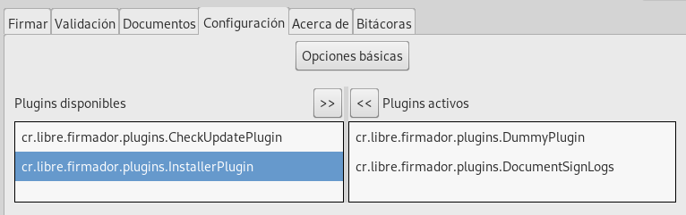

Instalación
###########################

Firmador libre es una aplicación escrita en java por lo que puede usarse el lanzador de java desde las preferencias de "abrir con".

En Windows se puede abrir directamente con doble clic.

En macOS se puede ejecutar también con doble clic, aunque la primera vez habrá
que abrirlo con control + clic o bien clic secundario sobre el fichero desde el
Finder y seleccionar Abrir. El sistema preguntará si se quiere abrir una
aplicación descargada de Internet y habrá que confirmar. Una vez hecho esto,
las siguientes aperturas funcionarán con doble clic.

En algunas distribuciones como Ubuntu se puede ejecutar con doble clic si se
configura el fichero como ejecutable. En las que no esté disponible esta
característica, se puede ejecutar desde terminal con `java -jar firmador.jar`.

En próximas versiones podría distribuirse con instaladores propios para Windows
y macOS, desde el momento en el que Oracle no ofrezca instaladores para Java y
por tanto deba incorporarse con el propio instalador. Asimismo, podrían
ofrecerse paquetes para distribuciones GNU/Linux para mayor comodidad de
ejecución.

Instalación mediante flatpak
------------------------------------

Para instalar mediante Flatpak debes tener instalado flatpak en tu ordenador, adicionalmente debes hacer los siguientes comandos

.. code:: bash

    flatpak install org.gnome.Platform/x86_64/45
    flatpak install firmador.flatpak
    
Si deseas desinstalarlo puede hacer los siguientes comandos.

.. code:: bash

    flatpak uninstall cr.libre.firmador
    
Instalación mediante plugin
-----------------------------------

Firmador libre posee un plugin de instalación para sistemas Windows y Linux el cual se puede activar desde la sección de configuración, opciones avanzadas y gestión de plugins.

Una vez activado reinicie la aplicación y acepte la instalación en el modal que se despliega.

